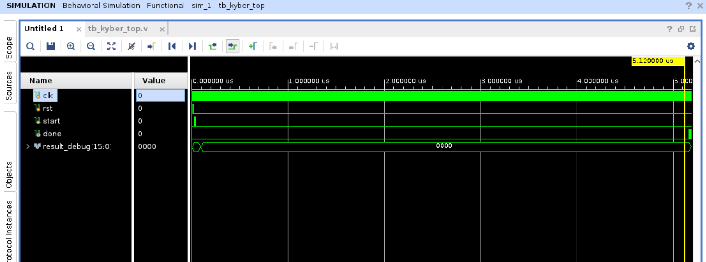
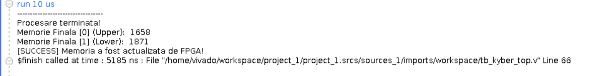

# Implementare Hardware NTT pentru Kyber (FPGA)

Acest proiect conține implementarea în Verilog a unității de procesare NTT (Number Theoretic Transform), folosită în algoritmul criptografic Kyber. Proiectul a fost realizat și testat în Vivado.

## Descriere Proiect

Obiectivul a fost realizarea unui accelerator hardware care să calculeze transformarea NTT pentru un set de 256 de coeficienți. Sistemul folosește aritmetică modulară (modulo 3329) și este optimizat pentru viteză folosind algoritmul Montgomery.

### Module Implementate:

* **Aritmetică:** Module pentru adunare (`mod_add`) și scădere (`mod_sub`) modulo 3329.
* **Multiplicator Montgomery:** Implementare pentru înmulțire rapidă, fără a folosi operația de împărțire (div), care este costisitoare pe FPGA.
* **Unitatea Butterfly:** Nucleul de calcul care procesează perechile de date (Cooley-Tukey).
* **Memorie (BRAM):** O memorie Dual-Port RAM pentru a putea citi și scrie doi coeficienți în același timp.
* **Control (FSM):** Un automat de stări care coordonează citirea din memorie, calculul și scrierea rezultatelor.

## Fișierele Surse

Codul este organizat astfel:

* `kyber_ntt_top.v` -> Modulul principal (Top level). Aici se află mașina de stări.
* `butterfly.v` -> Unitatea de procesare matematică.
* `montgomery_mul.v` -> Modulul de înmulțire.
* `dual_port_ram.v` -> Memoria pentru date.
* `mod_add.v` / `mod_sub.v` -> Operațiile de bază.
* `tb_kyber_top.v` -> Testbench-ul principal pentru simulare.

## Cum se rulează simularea

Proiectul a fost verificat în Xilinx Vivado (folosind simulatorul integrat).

1.  Se creează un proiect nou în Vivado (RTL Project).
2.  Se adaugă toate fișierele `.v` din acest folder la **Design Sources**.
3.  Se adaugă fișierele `tb_*.v` la **Simulation Sources**.
4.  Se setează `tb_kyber_top.v` ca **Top Module**.
5.  Se rulează **Run Behavioral Simulation**.

**Notă:** Pentru a vedea tot procesul de calcul, simularea trebuie rulată pentru aproximativ 5-6 microsecunde (comanda `run 10 us` în consola Tcl).

## Rezultate

În imaginea de mai jos se poate observa simularea completă. Semnalul `done` devine activ la finalul procesării, iar memoria conține valorile actualizate.

### Validare Numerică (Consola Tcl)

Pe lângă grafice, testbench-ul afișează valorile exacte calculate de FPGA. În imaginea de mai jos se observă că memoria a fost actualizată cu succes (valorile 1658 și 1871), confirmând corectitudinea algoritmului.

